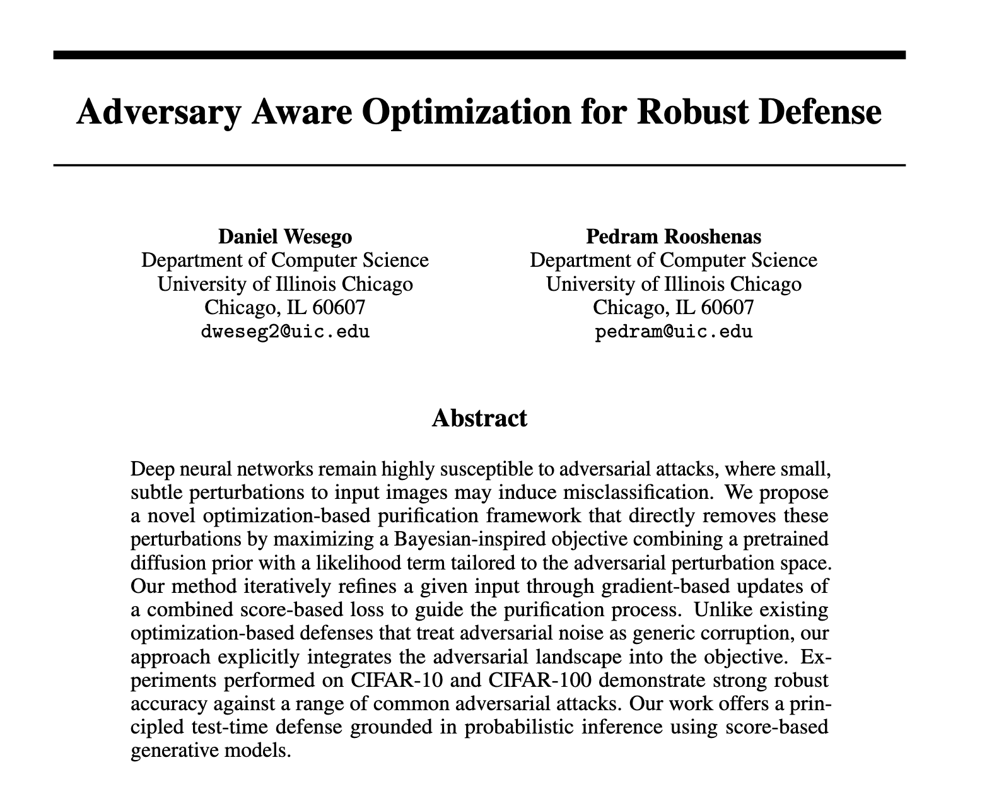

# Adversary Aware Optimization (AAOpt)

> This repository contains the implementation of **AAOpt** (Adversary Aware Optimization), a test-time adversarial purification framework that combines a diffusion prior with a learned perturbation model to defend against different adaptive adversarial attacks.



## Installation

1. **Clone the repository**:

   ```bash
   git clone https://github.com/******/AAOpt.git
   cd AAOpt
   ```

2. **Create a virtual environment**:

   ```bash
   python3 -m venv aaopt
   source aaopt/bin/activate
   ```

3. **Install dependencies**:

   ```bash
   pip install -r requirements.txt
   ```
### Download checkpoints [here](https://drive.google.com/file/d/1nbrYeYUcVZYYox5ER2ZWM2cUW51YdNBw/view?usp=sharing) and move to pretrained_models after extraction

## Usage CIFAR10 WRN-28-10

### 0. Use the provided checkpoint for CIFAR-10 or train one and put it in ./pretrained_models
Put the trained checkpoint on pretrained_models folder (checkpoint already provided in the official github repo) or do step 1.1 and 1.2 to train it yourself.

### 1. Train Perturbation-Score Model

Use the provided checkpoint (for cifar10 that works for the above provided classifier) for the perturbation model or train your model in the following steps:

#### 1.1. Generate Adversarial Examples

The following scripts generate adversarial data using AutoAttack for the classifier which may be slow. You can modify the code by implementing a faster PGD-attack.

  ```bash
  CUDA_VISIBLE_DEVICES="0" python gen_adv_ex.py \
    --clf-name "wideresnet-28-10" --dataset "CIFAR10" --norm "Linf" --eps 2

  CUDA_VISIBLE_DEVICES="0" python gen_adv_ex.py \
    --clf-name "wideresnet-28-10" --dataset "CIFAR10" --norm "Linf" --eps 4

  CUDA_VISIBLE_DEVICES="0" python gen_adv_ex.py \
    --clf-name "wideresnet-28-10" --dataset "CIFAR10" --norm "Linf" --eps 8

  CUDA_VISIBLE_DEVICES="0" python gen_adv_ex.py \
    --clf-name "wideresnet-28-10" --dataset "CIFAR10" --norm "L2" --eps 0.5

  CUDA_VISIBLE_DEVICES="0" python gen_adv_ex.py \
    --clf-name "wideresnet-28-10" --dataset "CIFAR10" --norm "L2" --eps 1.0
  ```


#### 1.2. Train Perturbation Model

  ```bash
  CUDA_VISIBLE_DEVICES="0" python train_sc_diff_j.py \
    --clf-name "wideresnet-28-10" --dataset "CIFAR10"
  ```

### 2. Run AAOpt Optimization

#### 2.1 PGD-EOT

  ```bash
  # with stop_grad through diffusion, grad passes through other optimization
  nohup bash sh/run_ep8_pgd_ex.sh 1>> run_ep8_pgd_ex.out
  ```

  ```bash
  # with no_stop_grad through diffusion
  nohup bash sh/run_ep8_pgd_ex_nosg.sh 1>> run_ep8_pgd_ex_nosg.out
  ```

#### 2.2 BPDA-EOT

  ```bash
  nohup bash sh/run_ep8_bpda.sh 1>> run_ep8_bpda.out
  ```

#### 2.3 AutoAttack one step grad

  ```bash
  # with stop_grad through diffusion, grad passes through other optimization
  nohup bash sh/run_ep8_aa_apprx.sh 1>> run_ep8_aa_apprx.out
  ```

  ```bash
  # with no_stop_grad through diffusion
  nohup bash sh/run_ep8_aa_apprx_nosg.sh 1>> run_ep8_aa_apprx_nosg.out
  ```

#### 2.4 CLIP transfer pgd

  ```bash
  nohup bash sh/run_ep8_tr_clip.sh 1>> run_ep8_tr_clip.out
  ```


This repository is based on previous work of [Score-Opt](https://github.com/zzzhangboya/ScoreOpt/tree/main). We thank the authors for their work.

### If you find this work useful, please cite our paper from Neurips 2025 conference:

```bibtex
@inproceedings{wesego2025adversary,
  title={Adversary Aware Optimization for Robust Defense},
  author={Daniel Wesego, Pedram Rooshenas},
  booktitle={The Thirty-ninth Annual Conference on Neural Information Processing Systems},
  year={2025},
  url={https://openreview.net/forum?id=VNbvk5pMS7}
}
```
